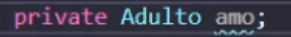

# Práctica 4
Practica realizada por [Samuele Tonarini](https://www.github.com/stonarini) y [Erik Pardillo](https://www.github.com/ErikPC). 

## Sube la Práctica3 a github como primera versión en la rama master.
  
Aqui podemos ver como ponemos el tag 1.0.0 al ultimo commit, iniciando asi el versionado semantico.

## Crea una rama nueva para desarrollo, y actualiza la versión.
Creamos y nos posicionamos en la branch develop:
```
$ git branch develop
$ git checkout develop
```

## Realiza 2 refactorizaciones.
  
Como primer cambio ponemos getter y setter a la clase Persona para el Perro.

  
  
Hacemos un *git add*, *commit* y luego un *tag* para actualizar la version.

  
Como segundo cambio haremos un override del metodo equals de Animal.

  
Repetimos el *add-commit-tag*.

## Actualiza la rama master con la nueva versión estable.
  
Ahora nos movemos a la branch main y mergeamos la develop. La opcion *--no-ff* sirve para mantener la relacion de las dos branchs, para ver que commits se hicieron en la main y cuales se mergearon.

## Realiza 2 refactorizaciones más en la rama de desarrollo desde la versión anterior.
Despues de hacer un *git push* desde un ordenador, haremos un pull desde el otro para conseguir los cambios.

  
Despues intoducimos otro cambio, en este caso un refactoring del nombre del atributo *dueno* de la clase Perro.


Ahora hacemos el add-commit-tag otra vez, pero esta vez actualizaremos solo el "PATCH" de la version ya que fue un cambio muy menor.

  
Ahora introducimos un cambio que rompe la interfaz de Gato, cambiando el constructor.

  
Volvemos a comitear los cambios, esta vez cambiando la version "MAYOR" ya que hemos roto la interfaz.

## Sube a máster lo anterior y actualiza la versión.
  
Ahora nos cambiamos a main y mergeamos la branch develop.

## Aplica comentarios en formato JavaDoc.
  
Anadimos comentarios JavaDoc al getter y setter que hemos introducido a la clase de Persona.

  
Comiteamos el cambio pero no le asignamos ningun tag.

  
Tambien anadimos JavaDoc al otro metodo que hemos introducido, el equal de Animal.

  
Ahora si que al comitear, le asignamos un tag.

## Utiliza Markdown para explicar lo que has hecho en la práctica.
Por ultimo hemos desarrollado este README, disponible en [repositorio](https://www.github.com/ErikPC/Practica4) respectivo de esta practica.